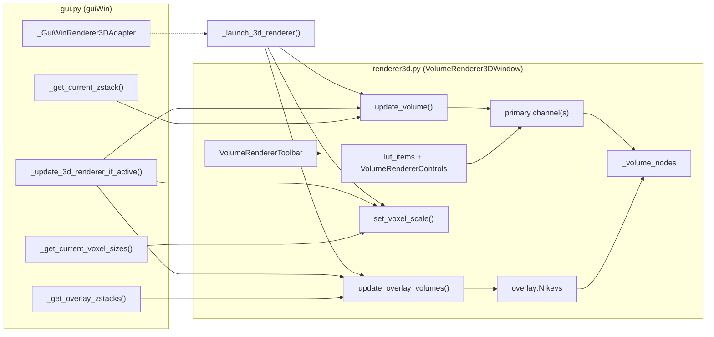

# 3D Renderer Feature Roadmap

Branch: `improvements_3d_renderer` · Fork HEAD: [`14edb05c`](https://github.com/SchmollerLab/Cell_ACDC/commit/14edb05c) · PR: [#1102](https://github.com/SchmollerLab/Cell_ACDC/pull/1102)

This folder tracks the 3D Z-stack renderer feature request in batches. The renderer lives in [`cellacdc/renderer3d.py`](../../cellacdc/renderer3d.py); the main GUI wires it through [`cellacdc/gui.py`](../../cellacdc/gui.py).

## Commits to honor

Upstream work by **ElpadoCan** on `improvements_3d_renderer` is the baseline this fork extends. When adding batches 2–4, preserve the multi-channel `_volume_nodes` model, overlay keys under `overlay:N` in the same dict, and colormap helpers in [`cellacdc/colors.py`](../../cellacdc/colors.py) (`vispy_cmap_from_spec` / `pg_to_vispy_cmap`). Do **not** revert Francesco's unified volume-node design or reintroduce `_ZPROJMODE_3D`.

| Commit | Message | Intent | Status on branch |
|--------|---------|--------|------------------|
| `a3ad90e9` | feat: add GPU-accelerated 3D z-stack renderer | Initial renderer | **Preserved** |
| `6e9efa5f` | fix: install vispy and PyOpenGL for CI tests | `requirements_test.txt` + CI workflows | **Honored** — still present |
| `0f64a810` | fix: test_rendered3d failing | Test fixes | Superseded by refactor; patterns updated |
| `3f0d6f2a` | fix: test_rendered3d failing because of GUI init | GUI init in tests | Superseded by refactor |
| `ca5f179d` | fix: test_rendered3d failing because not closing gui elements | Test cleanup | Superseded by refactor |
| `5fdb9237` | ci: ignore test_renderer3d because it requires a GUI environment | Module-level `pytest.skip` | **Honored** — restored in `14edb05c` |
| `537cd967` | WIP: improving UI of 3D renderer | Remove `_ZPROJMODE_3D`, decouple 3D from z-proj dropdown | **Honored** — no `_ZPROJMODE_3D` in codebase |
| `1dd00e8e` | improvement: use launch 3d renderer button with 3d icon | `launch3dRendererButton` / `launch3dRendererAction` with `:3d.svg` | **Honored** in `gui.py` |
| `391377c1` | WIP: support for multiple overlay volumes | Overlay volume support | **Evolved** — unified `_volume_nodes` with `overlay:N` keys (not parallel list) in `e9c6311b` |
| `e8aceb63` | broken: multiple volume nodes one per channel | Multi-channel volume model | **Fixed/evolved** in `e9c6311b` — per-channel nodes + batch 1 completion |
| `e9c6311b` | Complete 3D renderer batch 1 on the multi-channel volume model | Batch 1 deliverables | Current baseline |
| `14edb05c` | Honor ElpadoCan CI and renderer UI conventions | CI skip + `relative_step_size=current_step` | **Latest on fork** |

See [batch-1-done.md — Honored commits mapping](batch-1-done.md#honored-commits-mapping) for how each honored commit maps to delivered features.

## Key files

| File | Role |
|------|------|
| [`cellacdc/renderer3d.py`](../../cellacdc/renderer3d.py) | `VolumeRenderer3DWindow`, controls, LUT, overlay volume nodes |
| [`cellacdc/gui.py`](../../cellacdc/gui.py) | Launch adapter, `_get_overlay_zstacks()`, frame sync |
| [`cellacdc/widgets.py`](../../cellacdc/widgets.py) | `VolumeRendererToolbar`, `baseHistogramLUTitem`, `myHistogramLUTitem` |
| [`cellacdc/colors.py`](../../cellacdc/colors.py) | `pg_to_vispy_cmap`, `vispy_cmap_from_spec` |
| [`tests/test_renderer3d.py`](../../tests/test_renderer3d.py) | Smoke tests (module-level CI skip) |

## Feature progress

**Summary:** 16 Done · 0 Partial · 2 Not started (batch 4)

| # | Feature | Status | Batch | Notes |
|---|---------|--------|-------|-------|
| 1 | "Clim:" colorbar slider (main GUI parity) | **Done** | [Batch 2](batch-2-lut-overlays.md) | `myHistogramLUTitem` with `Clim:` label |
| 2 | Auto + Full LUT buttons | **Done** | [Batch 1](batch-1-done.md) | |
| 3 | Colormap from LUT slider | **Done** | [Batch 1](batch-1-done.md) | `pg_to_vispy_cmap` path |
| 4 | Gamma slider + numeric control | **Done** | [Batch 1](batch-1-done.md) | |
| 5 | Step slider + numeric control | **Done** | [Batch 1](batch-1-done.md) | |
| 6 | Primary opacity (right-side grayscale colorbar) | **Done** | [Batch 2](batch-2-lut-overlays.md) | Right-side opacity LUT; form sliders removed |
| 7 | Home button with icon in toolbar | **Done** | [Batch 1](batch-1-done.md) | |
| 8 | Top toolbar (Home + Save) | **Done** | [Batch 1](batch-1-done.md) | |
| 9 | Shortcut `H` for home | **Done** | [Batch 1](batch-1-done.md) | |
| 10 | Overlaid segmentation masks | **Done** | [Batch 1](batch-1-done.md) | Data path via `_get_overlay_zstacks()` |
| 11 | Overlaid fluorescence channels | **Done** | [Batch 1](batch-1-done.md) | Data path via `_get_overlay_zstacks()` |
| 12 | Opacity sliders for overlay channels | **Done** | [Batch 2](batch-2-lut-overlays.md) | In-renderer + bidirectional sync with main GUI |
| 13 | LUT sliders for overlay channels | **Done** | [Batch 2](batch-2-lut-overlays.md) | PG gradient from main GUI `lutItem` |
| 14 | Segmentation mask opacity slider in 3D UI | **Done** | [Batch 2](batch-2-lut-overlays.md) | Overlays panel + sync with `labelsAlphaSlider` |
| 15 | Cell ID selector (show one cell) | **Done** | [Batch 3](batch-3-cell-id.md) | Spinbox + Show all; `_label_volumes` masking |
| 16 | Clickable Cell ID (show one cell) | **Done** | [Batch 3](batch-3-cell-id.md) | Shift+left-click pick on canvas |
| 17 | z-anisotropy via `scipy.ndimage.zoom` | **Not started** | [Batch 4](batch-4-z-anisotropy.md) | Transform-only scaling today |
| 18 | z-anisotropy numeric control | **Not started** | [Batch 4](batch-4-z-anisotropy.md) | |

## Batch status

| Batch | Theme | Progress | Status | Doc |
|-------|-------|----------|--------|-----|
| 1 | Core renderer, toolbar, primary LUT, overlay data path, launch button (`:3d.svg`) | 10 / 10 scope items | **Complete** | [batch-1-done.md](batch-1-done.md) |
| 2 | LUT polish + in-renderer overlay UI + live sync | 5 / 5 checklist items | **Complete** | [batch-2-lut-overlays.md](batch-2-lut-overlays.md) |
| 3 | Cell ID isolation (selector + Shift+click pick) | 2 / 2 checklist items | **Complete** | [batch-3-cell-id.md](batch-3-cell-id.md) |
| 4 | z-anisotropy UI + `ndimage.zoom` resampling | 0 / 2 checklist items | **Planned** | [batch-4-z-anisotropy.md](batch-4-z-anisotropy.md) |

## Data flow

## Architecture notes

### Primary vs overlay colormap paths

- **Primary channel:** PyQtGraph LUT (`baseHistogramLUTitem`) → [`pg_to_vispy_cmap`](../../cellacdc/colors.py) → vispy `Volume.cmap`. Contrast limits come from gradient tick positions via `set_clim` / `set_cmap`.
- **Overlay channels:** Hardcoded colour names from [`_get_overlay_zstacks()`](../../cellacdc/gui.py) → [`vispy_cmap_from_spec`](../../cellacdc/colors.py) (black→colour ramp for plain names). Overlay LUT widgets in the main GUI are **not** read today.

### 2D/3D overlay colour mismatch

[`_get_overlay_zstacks()`](../../cellacdc/gui.py) assigns colours from `_FLUO_CMAPS` / `_LABEL_CMAPS` by index. It ignores each overlay's `lutItem` gradient (the two-colour ramp built in [`getOverlayItems()`](../../cellacdc/gui.py)). Batch 2 should align 3D overlay LUTs with the main GUI pattern.

### Shared rendering parameters

Overlay volumes inherit global **gamma**, **step**, and **interpolation** from `VolumeRendererControls`, not per-overlay LUT settings. See `_init_overlay_volume_node()` in [`renderer3d.py`](../../cellacdc/renderer3d.py).

### z-anisotropy today

Physical voxel sizes flow from metadata via `_get_current_voxel_sizes()` → `set_voxel_scale()` → vispy `STTransform`. No user-facing control and no `scipy.ndimage.zoom` resampling yet. See [batch-4-z-anisotropy.md](batch-4-z-anisotropy.md).
