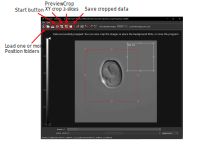

From 0 to Cell-ACDC mastery: A complete guide
=============================================

This guide should provide you with everything that you need to know about Cell-ACDC to become a true master. In the future, a abridged version of this guide as well as video tutorials will be added.
During several points during the usage of Cell-ACDC, the program may become unresponsive. **DO NOT CLOSE CELL-ACDC**. Instead, check the console for progress or error massages.

.. contents::

Running Cell-ACDC
-----------------

1. Open a **terminal** (on Windows use the **Anaconda Prompt** if you installed with ``conda``)
2. **Activate** the **environment** (conda: ``conda activate acdc``, pip on Windows: ``.\env\Scripts\activate``, pip on Unix: ``source env/bin/activate``) 
3. **Run** the command ``acdc`` or ``cellacdc``

The Main Menu
-------------
The main menu is a **hub** through which you can access all relevant modules.

.. figure:: https://github.com/SchmollerLab/Cell_ACDC/blob/main/cellacdc/docs/source/images/MainMenu.png?raw=true
    :alt: Overview of the main menu
    :target: https://github.com/SchmollerLab/Cell_ACDC/blob/main/cellacdc/docs/source/images/MainMenu.png?raw=true

    Overview of the main menu

Module buttons
~~~~~~~~~~~~~~
Through the main menu, all modules of Cell-ACDC can be accessed:

1. Create data structure from microscopy/image file(s)...
    This module will allow you to **create a suitable data structure** from raw microscopy files.
2. Launch data prep module...
    With this module you can **align** time-lapse microscopy data and select a **sharp image from a z-stack**, as well as **crop** images.
3. Launch segmentation module...
    Using this module, you can perform **segmentation** and **tracking** tasks using common methods.
4. Launch GUI...
    Lastly, using the GUI the resulting data can be **inspected** and **corrected** for mistakes. Also, **cell cycle annotation** can be carried out.

Top ribbon options include:
~~~~~~~~~~~~~~~~~~~~~~~~~~~
* Recent paths
    * Here you can access a **history of recent paths** used in any of the modules.
* Utilities
    * Some **extra utilities** which might be useful, including:
  
        * Convert file formats
        * Segmentation: Creating 3D segmentation masks
        * Tracking: Tracking and counting sub-cellular objects as well as applying tracking information from tabular data
        * Measurements: Tools for computing measurements
        * Add lineage tree table to one or more experiments
        * Concatenate acdc output tables from multiple positions
        * Create required data structure from image files
        * Re-apply data prep steps to selected channels
        * Align or revert alignment
        * Rename files by appending additional text
 
* Settings
    * Allows manipulation of the **user profile** path.
* Napari
    * View the Napari lineage tree. 
* Help
    * Provides links to **user manuals and start up guide**, as well as a link to the **relevant paper** for citation and guides on how to contribute, viewing the **log files** and show **additional info** about Cell-ACDC, including the **installation path**.

Additional options include:
~~~~~~~~~~~~~~~~~~~~~~~~~~~
* **Restoring** all open windows
  
        Restores all windows which were minimized 
* **Closing** the application and all active modules
* Toggle switch for **dark mode**

.. _creating-data-structure:

Creating Data Structure
-----------------------
**0. Create data structure from microscopy/image file(s)...**

The first step in analysing data with Cell-ACDC is creating a 
**suitable data structure** from raw microscopy files. This can be done c
ompletely automated using module 0.

.. warning:: 

    If you are on **MacOS** you will need to use the **ImageJ/Fiji macros** to 
    create the data structure. See the section :ref:`data-structure-fiji` 
    for details about how to use the macros.
    
    This is because the library ``python-bioformats`` does not work on MacOS. 
    We are working on alternatives, but in the meantime the Fiji macros will 
    work just fine. Thank you for you patience.

To start off, launch the module by pressing on the corresponding button in 
the main menu.

This will open a window in which you can choose how you want to proceed.

.. note::

    Cell-ACDC can use `Bio-Formats <https://www.openmicroscopy.org/bio-formats/>`__ or the AICSlmagelO libraries to read microscopy files.

    `Bio-Formats <https://www.openmicroscopy.org/bio-formats/>`__ requires Java and a python package called `Javabridge <hhttps://pypi.org/project/javabridge/>`__, that will be automatically installed if missing. We recommend using Bio-Formats, since it can read the metadata of the file, such as pixel size, numerical aperture etc.

    If Bio-Formats fails, try using AICSlmagelO.

    Alternatively, if you already pre-processed your microscopy files into TIF files, you could choose to simply re-structure them into the Cell-ACDC compatible format.

After choosing an option, another window will open prompting you to select **what kind of data** you want to extract from the raw microscopy file:

* Single microscopy file with multiple positions
* One or more microscopy files, one for each position
* One or more microscopy files, one for each channel
* NONE of the above

Please select the appropriate option. Afterwards, you are prompted to **create an empty folder** in which only the microscopy file(s) are present. After doing so, select "Done". Next, you will be prompted to select this folder. After selecting the **destination folder**, which by default is the folder you selected in the step before, Cell-ACDC will attempt to load OEM metadata.

.. |eyeplusicon| image:: https://raw.githubusercontent.com/SchmollerLab/Cell_ACDC/main/cellacdc/resources/icons/eye-plus.svg
    :target: https://raw.githubusercontent.com/SchmollerLab/Cell_ACDC/main/cellacdc/resources/icons/eye-plus.svg
    :alt: eye-plus icon
    :height: 16px
    :width: 16px

A window with the extracted metadata should appear, which may **take a few seconds to load**. Make sure to **double check** all values and **change "Order of Dimensions"** to the appropriate value. To double **check if the dimensions are in the correct order**, select the eye icon (|eyeplusicon|) next to "Channel 0" and use the scrollbars to go through the z-coordinate and time-coordinate. Once all values are in order, press "Ok". If the values are the same for all positions, feel free to click "Use the above metadata for all the next positions".

.. note:: 
    that if you have several files, and you press "Ok" and not one of the two other options, the process will stop after each file, and you need to confirm the metadata again.

Each position is saved in a separate folder. The metadata are stored both in a TXT and SCV file, while the channels are stored in separate TIF files.

.. note:: 
    A computer with sufficient RAM is needed in this step! The required amount is heavily reliant on the size of the project.

    It is good practice to keep the original files for future reference, even though they are not needed in future steps.

.. figure:: https://github.com/SchmollerLab/Cell_ACDC/blob/main/cellacdc/docs/source/images/DataStruc1.png?raw=true
    :target: https://github.com/SchmollerLab/Cell_ACDC/blob/main/cellacdc/docs/source/images/DataStruc1.png?raw=true
    :alt: Creating Data Structures: Menu for selecting original file structure

.. figure:: https://github.com/SchmollerLab/Cell_ACDC/blob/main/cellacdc/docs/source/images/DataStruc2.png?raw=true
    :target: https://github.com/SchmollerLab/Cell_ACDC/blob/main/cellacdc/docs/source/images/DataStruc2.png?raw=true
    :alt: Creating Data Structures: Second menu for selecting original file structure

.. figure:: https://github.com/SchmollerLab/Cell_ACDC/blob/main/cellacdc/docs/source/images/DataStruc3.png?raw=true
    :target: https://github.com/SchmollerLab/Cell_ACDC/blob/main/cellacdc/docs/source/images/DataStruc3.png?raw=true
    :alt: Creating Data Structures: Prompt for creating a empty folder and putting microscopy files inside

.. figure:: https://github.com/SchmollerLab/Cell_ACDC/blob/main/cellacdc/docs/source/images/DataStruc4.png?raw=true
    :target: https://github.com/SchmollerLab/Cell_ACDC/blob/main/cellacdc/docs/source/images/DataStruc4.png?raw=true
    :alt: Creating Data Structures: Folder selection

.. figure:: https://github.com/SchmollerLab/Cell_ACDC/blob/main/cellacdc/docs/source/images/DataStruc5.png?raw=true
    :target: https://github.com/SchmollerLab/Cell_ACDC/blob/main/cellacdc/docs/source/images/DataStruc5.png?raw=true
    :alt: Creating Data Structures: Metadata menu

.. figure:: https://github.com/SchmollerLab/Cell_ACDC/blob/main/cellacdc/docs/source/images/DataStruc6.png?raw=true
    :target: https://github.com/SchmollerLab/Cell_ACDC/blob/main/cellacdc/docs/source/images/DataStruc6.png?raw=true
    :alt: Creating Data Structures: Window for checking order of dimensions

Data-structure created by Cell-ACDC
~~~~~~~~~~~~~~~~~~~~~~~~~~~~~~~~~~~

.. code-block:: 

    Experiment folder
    ├── Position_1
    │   └── Images
    │       ├── basename_s01_metadataXML.txt
    │       ├── basename_s01_metadata.csv
    │       ├── basename_s01_ChannelName1.tif
    │       ├── basename_s01_ChannelName2.tif
    │       ...
    ├── Position_2
    │   └── Images
    │       ├── basename_s01_metadataXML.txt
    │       ...
    └── Position_n
        └── Images
            ├── basename_s0n_metadataXML.txt
            ...

Preparing data for further analysis (Data-prep)
-----------------------------------------------

**1. Launch data prep module…**

.. |starticon| image:: https://raw.githubusercontent.com/SchmollerLab/Cell_ACDC/main/cellacdc/resources/icons/start.svg
    :target: https://raw.githubusercontent.com/SchmollerLab/Cell_ACDC/main/cellacdc/resources/icons/start.svg
    :alt: start icon
    :height: 16px
    :width: 16px

.. |bkgrRoiicon| image:: https://raw.githubusercontent.com/SchmollerLab/Cell_ACDC/main/cellacdc/resources/icons/bkgrRoi.svg
    :target: https://raw.githubusercontent.com/SchmollerLab/Cell_ACDC/main/cellacdc/resources/icons/bkgrRoi.svg
    :alt: bkgrRoi icon
    :height: 16px
    :width: 16px

.. |add_crop_ROI| image:: https://raw.githubusercontent.com/SchmollerLab/Cell_ACDC/main/cellacdc/resources/icons/add_crop_ROI.svg
    :target: https://raw.githubusercontent.com/SchmollerLab/Cell_ACDC/main/cellacdc/resources/icons/add_crop_ROI.svg
    :alt: add_crop_ROI icon
    :height: 16px
    :width: 16px

.. |crop| image:: https://raw.githubusercontent.com/SchmollerLab/Cell_ACDC/main/cellacdc/resources/icons/crop.svg
    :target: https://raw.githubusercontent.com/SchmollerLab/Cell_ACDC/main/cellacdc/resources/icons/crop.svg
    :alt: crop icon
    :height: 16px
    :width: 16px

.. |save| image:: https://raw.githubusercontent.com/SchmollerLab/Cell_ACDC/main/cellacdc/resources/icons/file-save.svg
    :target: https://raw.githubusercontent.com/SchmollerLab/Cell_ACDC/main/cellacdc/resources/icons/file-save.svg
    :alt: crop icon
    :height: 16px
    :width: 16px

.. |cropZ| image:: https://raw.githubusercontent.com/SchmollerLab/Cell_ACDC/main/cellacdc/resources/icons/cropZ.svg
    :target: https://raw.githubusercontent.com/SchmollerLab/Cell_ACDC/main/cellacdc/resources/icons/cropZ.svg
    :alt: cropZ icon
    :height: 16px
    :width: 16px

.. |zforw| image:: https://raw.githubusercontent.com/SchmollerLab/Cell_ACDC/main/cellacdc/resources/icons/zforw.svg
    :target: https://raw.githubusercontent.com/SchmollerLab/Cell_ACDC/main/cellacdc/resources/icons/zforw.svg
    :alt: zforw icon
    :height: 16px
    :width: 16px

.. |zback| image:: https://raw.githubusercontent.com/SchmollerLab/Cell_ACDC/main/cellacdc/resources/icons/zback.svg
    :target: https://raw.githubusercontent.com/SchmollerLab/Cell_ACDC/main/cellacdc/resources/icons/zback.svg
    :alt: zback icon
    :height: 16px
    :width: 16px

.. |interp| image:: https://raw.githubusercontent.com/SchmollerLab/Cell_ACDC/main/cellacdc/resources/icons/interp.svg
    :target: https://raw.githubusercontent.com/SchmollerLab/Cell_ACDC/main/cellacdc/resources/icons/interp.svg
    :alt: interp icon
    :height: 16px
    :width: 16px

Through pressing "Launch data prep module…" in the main menu, the module can be launched. In this step you can:

a) Select a z-slice or z-projection for segmentation of 3D z-stacks.
b) Align frames of time-lapse microscopy data (RECOMMENDED, it is revertible).
c) Calculate background metrics (median, mean etc.) from one or more rectangular areas. The median will be used later for background subtraction. The areas are movable and resizable.
d) Select a region of interest (ROI) for segmentation.
e) Crop images to reduce memory usage (RECOMMENDED, if possible).

The alignment process is done using the function ``skimage.registration.phase_cross_correlation`` from the `scikit-image library <https://scikit-image.org/>`__.

To start off, click **"File"** in the top ribbon and then select **"Open"**. Select the position folder, for example "Position_1", which you want to start preparing. A pop up will appear which asks you for the channel name. Here you should input the channel on which **basis you want to align**.

In the next menu, select the **desired number of frames and z-slices**. Here you can also add another custom field, which will be saved in the metadata table. Later, this will be added as a column to the output table.

Next, go through each frame and **select the z-slice which is the sharpest** (if your data is 3D). Using the **buttons in the top button row**, you can apply the current slice to all future (|zforw|) or past (|zback|) frames, as well as apply a gradient (|interp|) from the current frame to the first one. The selection is saved automatically in (almost) real time. If you only need to do this step, feel free to close the window after finishing.

Alternatively, a projection can be used. This is done through the projection drop down menu in the bottom right.

Next, select **"start"** (|starticon|) from the buttons bar. This will **start the alignment process**. **The window may become unresponsive**, please check the terminal for progress.

.. note::

    Do this even if you don't have a time lapse experiment, as it allows you to carry on to the next step and won't change the data.

    For time-lapse microscopy you can load only one position at a time. Select multiple positions only if you have single 3D z-stacks or single 2D images.

Afterwards, the **region of interest (ROI)** as well as the **background ROI 
(Bkgr. ROI)** can be adjusted. This is done through drag and drop on the edges 
and resizing on the turquoise rhombuses. Make sure that the ROI covers all cells 
of interest on all frames and that the Bkgr. ROI is on an area without cells. 
**Multiple ROIs** (|add_crop_ROI|) **and Bkgr. ROIs** (|bkgrRoiicon|) can be 
added through the corresponding buttons. **Right click** on one of the frames 
to show an interaction menu through which you can **remove** it. 

.. tip:: 

    The background ROIs are used to compute background values from those areas. 
    These values will be saved in the ``acdc_output`` CSV table that you can 
    create with the module 3 ``Launch GUI...``. The background values specific 
    to these ROIs will be called ``<ChannelName>_dataPrepBkgr_bkgrVal_<metric_name>``, where 
    ``<metric_name>`` will be the ``median``, ``mean``, etc. 

    Additionally, the median of the background will be used to compute background 
    corrected measurements like ``amount_dataPrepBkgr`` (i.e., background corrected 
    sum intensity) and ``concentration_dataPrepBkgr``.

If you are working with 3D z-stacks and you want to crop z-slices click on the 
**"Crop z-slices"** (|cropZ|) button. 
Once all is set, press the **"Crop XY"** (|crop|) button to preview the crop.

To save the cropped data, click on the **"Save cropped data"** (|save|) button. 
**This will overwrite the previous files**. The window may become **unresponsive**. 

.. note::

    If the Bkgr. ROI is not visible, background from data-prep will not be 
    computed. If you want to set a Bkgr. ROI, press the Bkgr. ROI button 
    (|bkgrRoiicon|) to add as many background ROIs as needed.

Data such as the selected frame is stored in segmInfo.csv, while aligned.npz stores the alignment data.

.. figure:: https://github.com/SchmollerLab/Cell_ACDC/blob/main/cellacdc/docs/source/images/DataPrep1.png?raw=true
    :target: https://github.com/SchmollerLab/Cell_ACDC/blob/main/cellacdc/docs/source/images/DataPrep1.png?raw=true
    :alt: Data preparation: Selection menu for channel
    :width: 300

.. figure:: https://github.com/SchmollerLab/Cell_ACDC/blob/main/cellacdc/docs/source/images/DataPrep2.png?raw=true
    :target: https://github.com/SchmollerLab/Cell_ACDC/blob/main/cellacdc/docs/source/images/DataPrep2.png?raw=true
    :alt: Data preparation: Image properties
    :width: 300

Segmentation and tracking
-------------------------
**2. Launch segmentation module…**

This module can be used to **segment and track objects** in your data. A plethora of options are available already, and new ones are added constantly. You can also add **your own models**, for this please see `this guide <https://cell-acdc.readthedocs.io/en/latest/models.html#adding-a-new-model>`__.

Upon launching the module, you first will be prompted to **select a folder**. This process is the same as before. Next, like before, you are prompted to select a channel which should be **used for segmentation**.

After a short wait, you are prompted to **select the model** you want to use for **segmentation**, after which one needs to confirm the parameters for segmentation as well as post processing.

Next, you can **select a stop frame** if you don't want to segment and track the entire experiment. Lastly, you need to **select the model** which should be used for **tracking**. The process now begins, and you can lay back and watch the computer work for you.

.. figure:: https://github.com/SchmollerLab/Cell_ACDC/blob/main/cellacdc/docs/source/images/Seg1.png?raw=true
    :target: https://github.com/SchmollerLab/Cell_ACDC/blob/main/cellacdc/docs/source/images/Seg1.png?raw=true
    :alt: Segmentation and Tracking: Segmentation model
    :width: 300

.. figure:: https://github.com/SchmollerLab/Cell_ACDC/blob/main/cellacdc/docs/source/images/Seg2.png?raw=true
    :target: https://github.com/SchmollerLab/Cell_ACDC/blob/main/cellacdc/docs/source/images/Seg2.png?raw=true
    :alt: Segmentation and Tracking: Parameters for model and post processing parameters

.. figure:: https://github.com/SchmollerLab/Cell_ACDC/blob/main/cellacdc/docs/source/images/Seg3.png?raw=true
    :target: https://github.com/SchmollerLab/Cell_ACDC/blob/main/cellacdc/docs/source/images/Seg3.png?raw=true
    :alt: Segmentation and Tracking: Stop frame
    :width: 300

.. figure:: https://github.com/SchmollerLab/Cell_ACDC/blob/main/cellacdc/docs/source/images/Seg4.png?raw=true
    :target: https://github.com/SchmollerLab/Cell_ACDC/blob/main/cellacdc/docs/source/images/Seg4.png?raw=true
    :alt: Segmentation and Tracking: Tracking model
    :width: 300

.. figure:: https://github.com/SchmollerLab/Cell_ACDC/blob/main/cellacdc/docs/source/images/GUI5.png?raw=true
    :target: https://github.com/SchmollerLab/Cell_ACDC/blob/main/cellacdc/docs/source/images/GUI5.png?raw=true
    :alt: Segmentation and Tracking: File structure
    :width: 500

Correcting Tracking and Segmentation Mistakes, Cell Cycle Annotation
--------------------------------------------------------------------
**3. Launching GUI…**

.. |loadfolder| image:: https://raw.githubusercontent.com/SchmollerLab/Cell_ACDC/3dcf5611281c35e3cf8b7676ca7c00c9b17ee8e7/cellacdc/resources/icons/folder-open.svg
    :target: https://github.com/SchmollerLab/Cell_ACDC/blob/main/cellacdc/resources/icons/folder-open.svg
    :alt: Eraser icon
    :height: 16px
    :width: 16px

The GUI is very useful to review and annotate data. For a full breakdown of all tools, please see the section `GUI tools <https://cell-acdc.readthedocs.io/en/latest/tooltips.html>`__.

Its main functions are:

    a) **Test** which **segmentation method** works best for your dataset.
    b) **Correct** segmentation and tracking errors.
    c) Cell cycle **annotations**.

Usage with time lapse data
~~~~~~~~~~~~~~~~~~~~~~~~~~
For time-lapse data, you can load one position (one video) at a time. With this data, the GUI has three modes that can be toggled from the selector on the toolbar: 

 1. Viewer mode (default mode, used only for visualisation).
 2. Cell cycle analysis mode.
 3. Segmentation and tracking mode.
   
The main idea is that when you visit a frame for the first time, some automatic functions are triggered: tracking in `"Segmentation and tracking" <https://cell-acdc.readthedocs.io/en/latest/getting-started.html#correcting-tracking-and-segmentation-mistakes>`__ mode, mother-bud pairing in `"Cell cycle analysis" <https://cell-acdc.readthedocs.io/en/latest/getting-started.html#cell-cycle-annotation>`__ mode. See the `GUI tools section <https://cell-acdc.readthedocs.io/en/latest/tooltips.html>`__ for a run down of all tools.

These functions are not triggered when you visualize a frame that you already visited before.

Usage with snapshot data (no time-lapse)
~~~~~~~~~~~~~~~~~~~~~~~~~~~~~~~~~~~~~~~~

For snapshot data, you can load multiple positions at the same time. When prompted, simply click on multiple selection button, and then select the positions with ``Ctrl+click`` for selecting specific positions, or ``Shift+click`` to select a range, or ``Ctrl+A`` to select all.

Once loaded, you can navigate through positions with left and right arrow or with the position scrollbar below the left image.

See sections `"Segmentation and tracking" <https://cell-acdc.readthedocs.io/en/latest/getting-started.html#correcting-tracking-and-segmentation-mistakes>`__ and `"Cell cycle analysis" <https://cell-acdc.readthedocs.io/en/latest/getting-started.html#cell-cycle-annotation>`__ for further information. See the `GUI tools section <https://cell-acdc.readthedocs.io/en/latest/tooltips.html>`__ for a run down of all tools.

Correcting Tracking and Segmentation Mistakes
~~~~~~~~~~~~~~~~~~~~~~~~~~~~~~~~~~~~~~~~~~~~~
The first step in using the GUI is to load a file. For this, click on **"File"** in the top ribbon and select **"Load folder"**, or directly select the corresponding button (|loadfolder|). This will open a window which prompts you to select a folder. After selecting the folder containing the information for the position you want to analyse, you will be prompted to **select the channel you want to view** as well as double **check the metadata**.

Alternatively, if only a single image or video should be analysed, select ``File → Open image/video file…``.

.. note:: 
    If you load a single image or video file without the required data structure, the Cell-ACDC output will be saved in a sub-folder called ``<timestamp>_acdc_output``.

After first loading data, you will notice that the current mode is set to "Viewer". This allows you to freely browse through all images, which can be useful for gaining an overview of the data.

To start editing, change the mode to **"Segmentation and Tracking"**.

**Important tools:**

.. |eraser| image:: https://raw.githubusercontent.com/SchmollerLab/Cell_ACDC/3dcf5611281c35e3cf8b7676ca7c00c9b17ee8e7/cellacdc/resources/icons/eraser.svg
    :target: https://github.com/SchmollerLab/Cell_ACDC/blob/main/cellacdc/resources/icons/eraser.svg
    :alt: Eraser icon
    :height: 16px
    :width: 16px

.. |brush| image:: https://raw.githubusercontent.com/SchmollerLab/Cell_ACDC/3dcf5611281c35e3cf8b7676ca7c00c9b17ee8e7/cellacdc/resources/icons/brush.svg
    :target: https://github.com/SchmollerLab/Cell_ACDC/blob/main/cellacdc/resources/icons/brush.svg
    :alt: Brush icon
    :height: 16px
    :width: 16px

.. |separate| image:: https://raw.githubusercontent.com/SchmollerLab/Cell_ACDC/3dcf5611281c35e3cf8b7676ca7c00c9b17ee8e7/cellacdc/resources/icons/separate-bud.svg
    :target: https://github.com/SchmollerLab/Cell_ACDC/blob/main/cellacdc/resources/icons/separate-bud.svg
    :alt: Separate icon
    :height: 16px
    :width: 16px
    
.. |EditID| image:: https://raw.githubusercontent.com/SchmollerLab/Cell_ACDC/3dcf5611281c35e3cf8b7676ca7c00c9b17ee8e7/cellacdc/resources/icons/edit-id.svg
    :target: https://github.com/SchmollerLab/Cell_ACDC/blob/main/cellacdc/resources/icons/edit-id.svg
    :alt: Edit ID icon
    :height: 16px
    :width: 16px

.. |MergeIDs| image:: https://raw.githubusercontent.com/SchmollerLab/Cell_ACDC/3dcf5611281c35e3cf8b7676ca7c00c9b17ee8e7/cellacdc/resources/icons/merge-IDs.svg
    :target: https://github.com/SchmollerLab/Cell_ACDC/blob/main/cellacdc/resources/icons/merge-IDs.svg
    :alt: Merge IDs icon
    :height: 16px
    :width: 16px

.. |AnnotateAsDead| image:: https://raw.githubusercontent.com/SchmollerLab/Cell_ACDC/3dcf5611281c35e3cf8b7676ca7c00c9b17ee8e7/cellacdc/resources/icons/rip.svg
    :target: https://github.com/SchmollerLab/Cell_ACDC/blob/main/cellacdc/resources/icons/rip.svg
    :alt: Annotate as dead icon
    :height: 16px
    :width: 16px

.. |ExcludeFromAnalysis| image:: https://raw.githubusercontent.com/SchmollerLab/Cell_ACDC/3dcf5611281c35e3cf8b7676ca7c00c9b17ee8e7/cellacdc/resources/icons/bin.svg
    :target: https://github.com/SchmollerLab/Cell_ACDC/blob/main/cellacdc/resources/icons/bin.svg
    :alt: Exclude from analysis icon
    :height: 16px
    :width: 16px

.. |DeletionRegion| image:: https://raw.githubusercontent.com/SchmollerLab/Cell_ACDC/3dcf5611281c35e3cf8b7676ca7c00c9b17ee8e7/cellacdc/resources/icons/addDelRoi.svg
    :target: https://github.com/SchmollerLab/Cell_ACDC/blob/main/cellacdc/resources/icons/addDelRoi.svg
    :alt: Deletion region icon
    :height: 16px
    :width: 16px

.. |DelBorder| image:: https://raw.githubusercontent.com/SchmollerLab/Cell_ACDC/3dcf5611281c35e3cf8b7676ca7c00c9b17ee8e7/cellacdc/resources/icons/delBorderObj.svg
    :target: https://github.com/SchmollerLab/Cell_ACDC/blob/main/cellacdc/resources/icons/delBorderObj.svg
    :alt: Delete all objects touching ROI border icon
    :height: 16px
    :width: 16px

.. |ReinitLastSegm| image:: https://raw.githubusercontent.com/SchmollerLab/Cell_ACDC/3dcf5611281c35e3cf8b7676ca7c00c9b17ee8e7/cellacdc/resources/icons/reinitLastSegm.svg
    :target: https://github.com/SchmollerLab/Cell_ACDC/blob/main/cellacdc/resources/icons/reinitLastSegm.svg
    :alt: repeat segmentation icon
    :height: 16px
    :width: 16px

.. |Repeat-tracking| image:: https://raw.githubusercontent.com/SchmollerLab/Cell_ACDC/3dcf5611281c35e3cf8b7676ca7c00c9b17ee8e7/cellacdc/resources/icons/repeat-tracking.svg
    :target: https://github.com/SchmollerLab/Cell_ACDC/blob/main/cellacdc/resources/icons/repeat-tracking.svg
    :alt: Repeat tracking icon
    :height: 16px
    :width: 16px

.. |eye-plus| image:: https://raw.githubusercontent.com/SchmollerLab/Cell_ACDC/3dcf5611281c35e3cf8b7676ca7c00c9b17ee8e7/cellacdc/resources/icons/eye-plus.svg
    :target: https://github.com/SchmollerLab/Cell_ACDC/blob/main/cellacdc/resources/icons/eye-plus.svg
    :alt: eye-plus icon
    :height: 16px
    :width: 16px

* |eraser| **"Eraser"** and |brush| **"Brush"** function as you expect.
* |separate| **"Separation**" can be used to s**eparate two cells** which were not segmented properly.
* |EditID| **"Edit ID"** can be used to **change the ID** of a cell and mend tracking errors.
* |MergeIDs| **"Merge IDs"** for **merging two IDs** if a cell was segmented into two parts.
* |AnnotateAsDead| **"Annotate as dead"**, |ExcludeFromAnalysis| **"exclude from analysis"**, |DeletionRegion| **"deletion region"** and |DelBorder| "**delete all objects touching ROI border"** for **excluding cells** or regions from analysis.
* |Repeat-tracking| **"Repeat tracking"** and |reinitLastSegm| **"repeat segmentation"** for **repeating** the respective processes, which can be used to bring frame in line with previous frames.

**Important tips:**

* Cells with a **thick red contour** and **thick ID** are **new cells** which were not present in the previous frame.
* **Yellow contours** with a **yellow ID** and a question mark show the contours of cells which were present in the previous frame but are **missing** in the currently viewed frame.
* Most **key bindings** can be **viewed** and customized via the menu found in the **top ribbon "Settings" menu**. 
* **"H"**: **centre** the picture. Double pressing **"H"**: **resets zoom**.
* **"Alt+Click+Drag"**: **pan/move** image
* **middle mouse button** (Windows) or **Cmd+Click** (MacOS): **delete** a cell ID.
* **"Ctrl+P"**: Visualize **cell cycle annotations** in a **table**.
* **"Ctrl+L"**: **Relabel** object IDs sequentially (1,2,3...etc).
* **"Ctrl+F"**: **Search** and **highlight** specific object ID.
* **Right click** on any point in the picture to reveal **more options**. Most importantly, the option to show a **duplicate picture**. This is useful to both view the contours and the segmentation mask.
* **"Spacebar"**: **Hide/show contours** or **segmentation masks** on left image
* **Double tap a binding** for a tool to select the **"empowered" version**, which can **draw over any cells**. Otherwise, tools only influence the cell on which you start drawing. 
* **Shift while drawing with the brush** will force a **new ID** creation.
* You can use the **arrow keys** to **navigate** between frames.
* To **test** the available **segmentation models**, use the ``Segment`` menu.
* To **visualize** the **frames** of time-lapse data in a second window click on the |eye-plus| **"Slideshow"** button on the toolbar
* **Personalize settings** such as font Size, overlay colour and text's colour from the ``Edit`` menu.

Cell Cycle Annotation
~~~~~~~~~~~~~~~~~~~~~

After correcting all errors, change the mode to "Cell Cycle Analysis". You will be presented with a warning that suggests starting from the first frame, which you usually should heed. Important tools for CC-Ana:

.. |assign-motherbud| image:: https://raw.githubusercontent.com/SchmollerLab/Cell_ACDC/3dcf5611281c35e3cf8b7676ca7c00c9b17ee8e7/cellacdc/resources/icons/assign-motherbud.svg
    :target: https://github.com/SchmollerLab/Cell_ACDC/blob/main/cellacdc/resources/icons/assign-motherbud.svg
    :alt: Assign bud to mother icon
    :height: 16px
    :width: 16px

.. |history| image:: https://raw.githubusercontent.com/SchmollerLab/Cell_ACDC/3dcf5611281c35e3cf8b7676ca7c00c9b17ee8e7/cellacdc/resources/icons/history.svg
    :target: https://github.com/SchmollerLab/Cell_ACDC/blob/main/cellacdc/resources/icons/history.svg
    :alt: Annotate unknown history icon
    :height: 16px
    :width: 16px

.. |reinitCca| image:: https://raw.githubusercontent.com/SchmollerLab/Cell_ACDC/3dcf5611281c35e3cf8b7676ca7c00c9b17ee8e7/cellacdc/resources/icons/reinitCca.svg
    :target: https://github.com/SchmollerLab/Cell_ACDC/blob/main/cellacdc/resources/icons/reinitCca.svg
    :alt: Reinitialize cell cycle annotation icon
    :height: 16px
    :width: 16px

* |assign-motherbud| **"Assign bud to mother"** is used if automatic assignment is wrong. For this activate the tool, then press and hold the right mouse button on the bud, then drag to the mother and release.
* |history| **"Annotate unknown history"** can be used to annotate cells which have unknown history.
* |reinitCca| **"Reinitialize cell cycle annotation"** for running cell cycle annotation from this frame foreword to make them in line with current edits.
* **"Right click on mother/bud pair"** will **break the bond**. Right click **again** to **rebind** them. This needs to be done manually whenever a mother and bud separate.
  
After finishing annotating the first frame, you will be prompted to accept the current annotation. This is only to make sure that the initial annotations are correct.

.. figure:: https://github.com/SchmollerLab/Cell_ACDC/blob/main/cellacdc/docs/source/images/GUI1.png?raw=true
    :target: https://github.com/SchmollerLab/Cell_ACDC/blob/main/cellacdc/docs/source/images/GUI1.png?raw=true
    :alt: GUI: Select displayed channel
    :width: 300

.. figure:: https://github.com/SchmollerLab/Cell_ACDC/blob/main/cellacdc/docs/source/images/GUI2.png?raw=true
    :target: https://github.com/SchmollerLab/Cell_ACDC/blob/main/cellacdc/docs/source/images/GUI2.png?raw=true
    :alt: GUI: Metadata
    :width: 300

.. figure:: https://github.com/SchmollerLab/Cell_ACDC/blob/main/cellacdc/docs/source/images/GUI3.png?raw=true
    :target: https://github.com/SchmollerLab/Cell_ACDC/blob/main/cellacdc/docs/source/images/GUI3.png?raw=true
    :alt: GUI: GUI for segmentation and tracking

.. figure:: https://github.com/SchmollerLab/Cell_ACDC/blob/main/cellacdc/docs/source/images/GUI4.png?raw=true
    :target: https://github.com/SchmollerLab/Cell_ACDC/blob/main/cellacdc/docs/source/images/GUI4.png?raw=true
    :alt: GUI: GUI for cell cycle annotation

.. figure:: https://github.com/SchmollerLab/Cell_ACDC/blob/main/cellacdc/docs/source/images/GUI5.png?raw=true
    :target: https://github.com/SchmollerLab/Cell_ACDC/blob/main/cellacdc/docs/source/images/GUI5.png?raw=true
    :alt: GUI: File Structure
    :width: 500

All functions
~~~~~~~~~~~~~

See the `GUI tools section <https://cell-acdc.readthedocs.io/en/latest/tooltips.html>`__ for a full run down of all tools.

``File → Load fluorescent images…``

    Used to **load additional images** (e.g., fluorescence signal).

    Loaded images will be used to **calculate metrics** such as mean, median, total amount etc. See this section for more details.

``Edit → Smart handling of enabling/disabling tracking``

    The GUI has built-in automatic tracking for time-lapse data with the following behaviour:

        * If tracking is active (Disable tracking checkbox on the toolbar is UNCHECKED): When you visit a frame that you have never visited before, objects will be **automatically tracked** compared to previous frame.
        * If tracking is deactivated (Disable tracking checkbox on the toolbar is CHECKED): When you visit a frame already visited before, it will **not** be tracked.
  
    You can disable this automatic behaviour by unchecking Smart handling of enabling/disabling tracking.

    When you disable smart handling, you can enforce tracking on all visited frames no matter if they were previously visited or not. To force this, use the "Disable tracking" checkbox on the toolbar.

.. tip:: 
    
    This is useful when you know you have to repeat tracking on already visited frames. 
    
``Image → Normalise intensities → …``

    You can choose to **normalise the intensities** of the displayed images (saved data will not be modified) with the following methods:

        * Do not normalise: Displays raw image.
        * Convert to floating point format with values [0, 1]: Simply converts image to **floating point**, no normalisation is involved.
        * Rescale to [0,1]: Intensities are first converted to **floating point** if needed and then **STRETCHED** to convert the entire [0,1] range.
        * Normalize by max value: Intensities are **divided by the max value**.

**Shared:**

* Top ribbon:
    * File: File manipulation menu with options to load different positions, saving etc.
        * New
        * Load folder...
        * Open image/video file...
        * Open Recent
        * Load older versions...
        * Save
        * Save as...
        * Save only segme file
        * Load fluorescence images...
        * Load different Position...
        * Exit 
    * Edit: Some edit settings
        * Customize keyboard shortcuts
        * Text annotation colour
        * Overlay colour
        * Edit cell cycle annotations
        * Smart handling of enabling/disabling tracking
        * Automatic zoom to all cells when pressing "Next/Previous"
    * View: Some view settings
        * View cell cycle annotations
        * Show segmentation image
        * Show duplicated left image
    * Image: Image viewing settings and options
        * Properties (from config files)
        * Filters
        * Normalize intensities
        * Invert black/white
        * Save labels colormap
        * Randomly shuffle colormap
        * Optimise colormap
        * Zoom to objects (shortcut: H key)
        * Zoom out (shortcut: double press H key)
    * Segment: Settings for re-segmentation
        * Segment displayed frame
        * Segment multiple frames
        * Random walker
        * Segmentation post- processing
        * Enable automatic segmentation
        * Relabel IDs sequentially
    * Tracking: Settings for re-tracking
        * Select real-time tracking algorithm
        * Repeat tracking on multiple frames
        * Repeat tracking on current frame...
    * Measurement: Settings for adding and managing custom measurements    
        * Set measurements
        * Add custom measurement
        * Add combined measurement
    * Settings: Settings for changing the behaviour of tools, including **warning behaviour** and **not disabling tools after usage** 
    * Mode: change the mode
        * Segmentation and Tracking, Cell cycle analysis, Viewer, Custom annotations