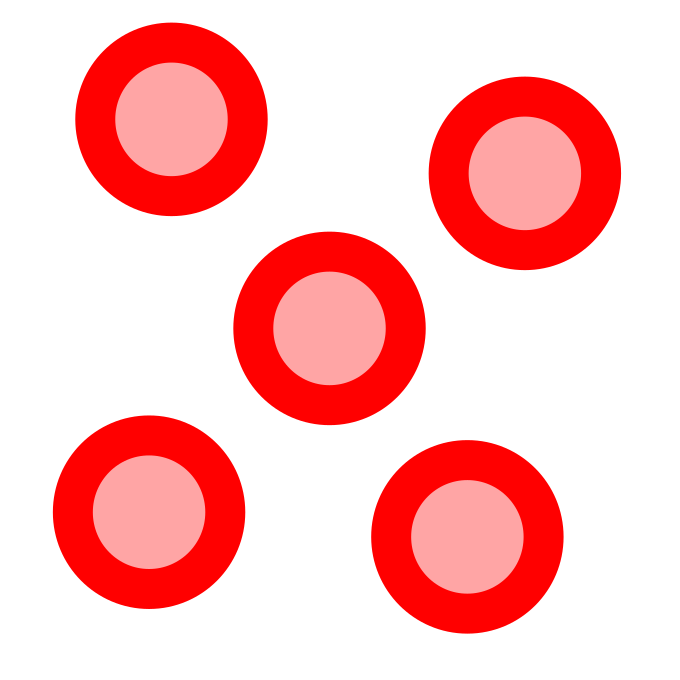
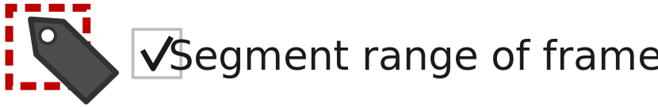

.. |newAction| image:: https://raw.githubusercontent.com/SchmollerLab/Cell_ACDC/3dcf5611281c35e3cf8b7676ca7c00c9b17ee8e7/cellacdc/resources/icons/file-new.svg
    :target: https://github.com/SchmollerLab/Cell_ACDC/blob/main/cellacdc/resources/icons/file-new.svg 
    :alt: file-new icon
    :height: 16px
    :width: 16px

.. |openFolderAction| image:: https://raw.githubusercontent.com/SchmollerLab/Cell_ACDC/3dcf5611281c35e3cf8b7676ca7c00c9b17ee8e7/cellacdc/resources/icons/folder-open.svg
    :target: https://github.com/SchmollerLab/Cell_ACDC/blob/main/cellacdc/resources/icons/folder-open.svg 
    :alt: folder-open icon
    :height: 16px
    :width: 16px

.. |manageVersionsAction| image:: https://raw.githubusercontent.com/SchmollerLab/Cell_ACDC/3dcf5611281c35e3cf8b7676ca7c00c9b17ee8e7/cellacdc/resources/icons/manage_versions.svg
    :target: https://github.com/SchmollerLab/Cell_ACDC/blob/main/cellacdc/resources/icons/manage_versions.svg 
    :alt: manageVersionsAction icon
    :height: 16px
    :width: 16px

.. |saveAction| image:: https://raw.githubusercontent.com/SchmollerLab/Cell_ACDC/3dcf5611281c35e3cf8b7676ca7c00c9b17ee8e7/cellacdc/resources/icons/file-save.svg
    :target: https://github.com/SchmollerLab/Cell_ACDC/blob/main/cellacdc/resources/icons/file-save.svg 
    :alt: saveAction icon
    :height: 16px
    :width: 16px

.. |showInExplorerAction| image:: https://raw.githubusercontent.com/SchmollerLab/Cell_ACDC/3dcf5611281c35e3cf8b7676ca7c00c9b17ee8e7/cellacdc/resources/icons/drawer.svg
    :target: https://github.com/SchmollerLab/Cell_ACDC/blob/main/cellacdc/resources/icons/drawer.svg 
    :alt: showInExplorerAction icon
    :height: 16px
    :width: 16px

.. |undoAction| image:: https://raw.githubusercontent.com/SchmollerLab/Cell_ACDC/3dcf5611281c35e3cf8b7676ca7c00c9b17ee8e7/cellacdc/resources/icons/undo.svg
    :target: https://github.com/SchmollerLab/Cell_ACDC/blob/main/cellacdc/resources/icons/undo.svg
    :alt: undoAction icon
    :height: 16px
    :width: 16px

.. |redoAction| image:: https://raw.githubusercontent.com/SchmollerLab/Cell_ACDC/3dcf5611281c35e3cf8b7676ca7c00c9b17ee8e7/cellacdc/resources/icons/redo.svg
    :target: https://github.com/SchmollerLab/Cell_ACDC/blob/main/cellacdc/resources/icons/redo.svg
    :alt: redoAction icon
    :height: 16px
    :width: 16px

.. |findIdAction| image:: https://raw.githubusercontent.com/SchmollerLab/Cell_ACDC/3dcf5611281c35e3cf8b7676ca7c00c9b17ee8e7/cellacdc/resources/icons/find.svg
    :target: https://github.com/SchmollerLab/Cell_ACDC/blob/main/cellacdc/resources/icons/find.svg 
    :alt: findIdAction icon
    :height: 16px
    :width: 16px

.. |autoPilotButton| image:: https://raw.githubusercontent.com/SchmollerLab/Cell_ACDC/3dcf5611281c35e3cf8b7676ca7c00c9b17ee8e7/cellacdc/resources/icons/find.svg
    :target: https://github.com/SchmollerLab/Cell_ACDC/blob/main/cellacdc/resources/icons/auto-pilot.svg 
    :alt: autoPilotButton icon
    :height: 16px
    :width: 16px

.. |slideshowButton| image:: https://raw.githubusercontent.com/SchmollerLab/Cell_ACDC/3dcf5611281c35e3cf8b7676ca7c00c9b17ee8e7/cellacdc/resources/icons/eye-plus.svg
    :target: https://github.com/SchmollerLab/Cell_ACDC/blob/main/cellacdc/resources/icons/eye-plus.svg 
    :alt: slideshowButton icon
    :height: 16px
    :width: 16px

.. |skipToNewIdAction| image:: https://raw.githubusercontent.com/SchmollerLab/Cell_ACDC/3dcf5611281c35e3cf8b7676ca7c00c9b17ee8e7/cellacdc/resources/icons/skip_forward_new_ID.svg
    :target: https://github.com/SchmollerLab/Cell_ACDC/blob/main/cellacdc/resources/icons/skip_forward_new_ID.svg 
    :alt: skipToNewIdAction icon
    :height: 16px
    :width: 16px

.. |overlayButton| image:: https://raw.githubusercontent.com/SchmollerLab/Cell_ACDC/main/cellacdc/resources/icons/overlay1.svg
    :target: https://github.com/SchmollerLab/Cell_ACDC/blob/main/cellacdc/resources/icons/overlay1.svg
    :alt: overlayButton icon
    :height: 16px
    :width: 16px

.. |addPointsLayerAction| image:: https://raw.githubusercontent.com/SchmollerLab/Cell_ACDC/3dcf5611281c35e3cf8b7676ca7c00c9b17ee8e7/cellacdc/resources/icons/addPointsLayer.svg
    :target: https://github.com/SchmollerLab/Cell_ACDC/blob/main/cellacdc/resources/icons/addPointsLayer.svg 
    :alt: addPointsLayerAction icon
    :height: 16px
    :width: 16px

.. |overlayLabelsButton| image:: https://raw.githubusercontent.com/SchmollerLab/Cell_ACDC/3dcf5611281c35e3cf8b7676ca7c00c9b17ee8e7/cellacdc/resources/icons/overlay_labels.svg
    :target: https://github.com/SchmollerLab/Cell_ACDC/blob/main/cellacdc/resources/icons/overlay_labels.svg 
    :alt: overlayLabelsButton icon
    :height: 16px
    :width: 16px

.. |rulerButton| image:: https://raw.githubusercontent.com/SchmollerLab/Cell_ACDC/3dcf5611281c35e3cf8b7676ca7c00c9b17ee8e7/cellacdc/resources/icons/ruler.svg
    :target: https://github.com/SchmollerLab/Cell_ACDC/blob/main/cellacdc/resources/icons/ruler.svg 
    :alt: rulerButton icon
    :height: 16px
    :width: 16px

.. |brushButton| image:: https://raw.githubusercontent.com/SchmollerLab/Cell_ACDC/3dcf5611281c35e3cf8b7676ca7c00c9b17ee8e7/cellacdc/resources/icons/brush.svg
    :target: https://github.com/SchmollerLab/Cell_ACDC/blob/main/cellacdc/resources/icons/brush.svg 
    :alt: brushButton icon
    :height: 16px
    :width: 16px

.. |eraserButton| image:: https://raw.githubusercontent.com/SchmollerLab/Cell_ACDC/3dcf5611281c35e3cf8b7676ca7c00c9b17ee8e7/cellacdc/resources/icons/eraser.svg
    :target: https://github.com/SchmollerLab/Cell_ACDC/blob/main/cellacdc/resources/icons/eraser.svg 
    :alt: eraserButton icon
    :height: 16px
    :width: 16px

.. |curvToolButton| image:: https://raw.githubusercontent.com/SchmollerLab/Cell_ACDC/3dcf5611281c35e3cf8b7676ca7c00c9b17ee8e7/cellacdc/resources/icons/curvature-tool.svg
    :target: https://github.com/SchmollerLab/Cell_ACDC/blob/main/cellacdc/resources/icons/curvature-tool.svg 
    :alt: curvToolButton icon
    :height: 16px
    :width: 16px

.. |wandToolButton| image:: https://raw.githubusercontent.com/SchmollerLab/Cell_ACDC/3dcf5611281c35e3cf8b7676ca7c00c9b17ee8e7/cellacdc/resources/icons/magic_wand.svg
    :target: https://github.com/SchmollerLab/Cell_ACDC/blob/main/cellacdc/resources/icons/magic_wand.svg 
    :alt: wandToolButton icon
    :height: 16px
    :width: 16px

.. |copyContourButton| image:: https://raw.githubusercontent.com/SchmollerLab/Cell_ACDC/3dcf5611281c35e3cf8b7676ca7c00c9b17ee8e7/cellacdc/resources/icons/copyContour.svg
    :target: https://github.com/SchmollerLab/Cell_ACDC/blob/main/cellacdc/resources/icons/copyContour.svg
    :alt: copyContourButton icon
    :height: 16px
    :width: 16px

.. |labelRoiButton| image:: https://raw.githubusercontent.com/SchmollerLab/Cell_ACDC/3dcf5611281c35e3cf8b7676ca7c00c9b17ee8e7/cellacdc/resources/icons/label_roi.svg
    :target: https://github.com/SchmollerLab/Cell_ACDC/blob/main/cellacdc/resources/icons/label_roi.svg
    :alt: labelRoiButton icon
    :height: 16px
    :width: 16px

.. |segmentToolAction| image:: https://raw.githubusercontent.com/SchmollerLab/Cell_ACDC/3dcf5611281c35e3cf8b7676ca7c00c9b17ee8e7/cellacdc/resources/icons/segment.svg
    :target: https://github.com/SchmollerLab/Cell_ACDC/blob/main/cellacdc/resources/icons/segment.svg 
    :alt: segmentToolAction icon
    :height: 16px
    :width: 16px

.. |manualBackgroundButton| image:: https://raw.githubusercontent.com/SchmollerLab/Cell_ACDC/3dcf5611281c35e3cf8b7676ca7c00c9b17ee8e7/cellacdc/resources/icons/manual_background.svg
    :target: https://github.com/SchmollerLab/Cell_ACDC/blob/main/cellacdc/resources/icons/manual_background.svg
    :alt: manualBackgroundButton icon
    :height: 16px
    :width: 16px

.. |delObjsOutSegmMaskAction| image:: https://raw.githubusercontent.com/SchmollerLab/Cell_ACDC/3dcf5611281c35e3cf8b7676ca7c00c9b17ee8e7/cellacdc/resources/icons/del_objs_out_segm.svg
    :target: https://github.com/SchmollerLab/Cell_ACDC/blob/main/cellacdc/resources/icons/del_objs_out_segm.svg 
    :alt: delObjsOutSegmMaskAction icon
    :height: 16px
    :width: 16px

.. |hullContToolButton| image:: https://raw.githubusercontent.com/SchmollerLab/Cell_ACDC/3dcf5611281c35e3cf8b7676ca7c00c9b17ee8e7/cellacdc/resources/icons/hull.svg
    :target: https://github.com/SchmollerLab/Cell_ACDC/blob/main/cellacdc/resources/icons/hull.svg
    :alt: hullContToolButton icon
    :height: 16px
    :width: 16px

.. |fillHolesToolButton| image:: https://raw.githubusercontent.com/SchmollerLab/Cell_ACDC/3dcf5611281c35e3cf8b7676ca7c00c9b17ee8e7/cellacdc/resources/icons/fill_holes.svg
    :target: https://github.com/SchmollerLab/Cell_ACDC/blob/main/cellacdc/resources/icons/fill_holes.svg
    :alt: fillHolesToolButton icon
    :height: 16px
    :width: 16px

.. |moveLabelToolButton| image:: https://raw.githubusercontent.com/SchmollerLab/Cell_ACDC/3dcf5611281c35e3cf8b7676ca7c00c9b17ee8e7/cellacdc/resources/icons/moveLabel.svg
    :target: https://github.com/SchmollerLab/Cell_ACDC/blob/main/cellacdc/resources/icons/moveLabel.svg
    :alt: moveLabelToolButton icon
    :height: 16px
    :width: 16px

.. |expandLabelToolButton| image:: https://raw.githubusercontent.com/SchmollerLab/Cell_ACDC/3dcf5611281c35e3cf8b7676ca7c00c9b17ee8e7/cellacdc/resources/icons/expandLabel.svg
    :target: https://github.com/SchmollerLab/Cell_ACDC/blob/main/cellacdc/resources/icons/expandLabel.svg
    :alt: expandLabelToolButton icon
    :height: 16px
    :width: 16px

.. |editIDbutton| image:: https://raw.githubusercontent.com/SchmollerLab/Cell_ACDC/3dcf5611281c35e3cf8b7676ca7c00c9b17ee8e7/cellacdc/resources/icons/edit-id.svg
    :target: https://github.com/SchmollerLab/Cell_ACDC/blob/main/cellacdc/resources/icons/edit-id.svg
    :alt: editIDbutton icon
    :height: 16px
    :width: 16px

.. |separateBudButton| image:: https://raw.githubusercontent.com/SchmollerLab/Cell_ACDC/3dcf5611281c35e3cf8b7676ca7c00c9b17ee8e7/cellacdc/resources/icons/separate-bud.svg
    :target: https://github.com/SchmollerLab/Cell_ACDC/blob/main/cellacdc/resources/icons/separate-bud.svg
    :alt: separateBudButton icon
    :height: 16px
    :width: 16px

.. |mergeIDsButton| image:: https://raw.githubusercontent.com/SchmollerLab/Cell_ACDC/3dcf5611281c35e3cf8b7676ca7c00c9b17ee8e7/cellacdc/resources/icons/merge-IDs.svg
    :target: https://github.com/SchmollerLab/Cell_ACDC/blob/main/cellacdc/resources/icons/merge-IDs.svg
    :alt: mergeIDsButton icon
    :height: 16px
    :width: 16px

.. |keepIDsButton| image:: https://raw.githubusercontent.com/SchmollerLab/Cell_ACDC/3dcf5611281c35e3cf8b7676ca7c00c9b17ee8e7/cellacdc/resources/icons/keep_objects.svg
    :target: https://github.com/SchmollerLab/Cell_ACDC/blob/main/cellacdc/resources/icons/keep_objects.svg
    :alt: keepIDsButton icon
    :height: 16px
    :width: 16px

.. |binCellButton| image:: https://raw.githubusercontent.com/SchmollerLab/Cell_ACDC/3dcf5611281c35e3cf8b7676ca7c00c9b17ee8e7/cellacdc/resources/icons/bin.svg
    :target: https://github.com/SchmollerLab/Cell_ACDC/blob/main/cellacdc/resources/icons/bin.svg
    :alt: binCellButton icon
    :height: 16px
    :width: 16px

.. |ripCellButton| image:: https://raw.githubusercontent.com/SchmollerLab/Cell_ACDC/3dcf5611281c35e3cf8b7676ca7c00c9b17ee8e7/cellacdc/resources/icons/rip.svg
    :target: https://github.com/SchmollerLab/Cell_ACDC/blob/main/cellacdc/resources/icons/rip.svg
    :alt: ripCellButton icon
    :height: 16px
    :width: 16px

.. |addDelRoiAction| image:: https://raw.githubusercontent.com/SchmollerLab/Cell_ACDC/3dcf5611281c35e3cf8b7676ca7c00c9b17ee8e7/cellacdc/resources/icons/addDelRoi.svg
    :target: https://github.com/SchmollerLab/Cell_ACDC/blob/main/cellacdc/resources/icons/addDelRoi.svg
    :alt: addDelRoiAction icon
    :height: 16px
    :width: 16px

.. |addDelPolyLineRoiAction| image:: https://raw.githubusercontent.com/SchmollerLab/Cell_ACDC/3dcf5611281c35e3cf8b7676ca7c00c9b17ee8e7/cellacdc/resources/icons/addDelPolyLineRoi.svg
    :target: https://github.com/SchmollerLab/Cell_ACDC/blob/main/cellacdc/resources/icons/addDelPolyLineRoi.svg
    :alt: addDelPolyLineRoiAction icon
    :height: 16px
    :width: 16px

.. |delBorderObjAction| image:: https://raw.githubusercontent.com/SchmollerLab/Cell_ACDC/3dcf5611281c35e3cf8b7676ca7c00c9b17ee8e7/cellacdc/resources/icons/delBorderObj.svg
    :target: https://github.com/SchmollerLab/Cell_ACDC/blob/main/cellacdc/resources/icons/delBorderObj.svg
    :alt: delBorderObjAction icon
    :height: 16px
    :width: 16px

.. |repeatTrackingAction| image:: https://raw.githubusercontent.com/SchmollerLab/Cell_ACDC/3dcf5611281c35e3cf8b7676ca7c00c9b17ee8e7/cellacdc/resources/icons/repeat-tracking.svg
    :target: https://github.com/SchmollerLab/Cell_ACDC/blob/main/cellacdc/resources/icons/repeat-tracking.svg
    :alt: repeatTrackingAction icon
    :height: 16px
    :width: 16px

.. |manualTrackingButton| image:: https://raw.githubusercontent.com/SchmollerLab/Cell_ACDC/3dcf5611281c35e3cf8b7676ca7c00c9b17ee8e7/cellacdc/resources/icons/manual_tracking.svg
    :target: https://github.com/SchmollerLab/Cell_ACDC/blob/main/cellacdc/resources/icons/manual_tracking.svg
    :alt: manualTrackingButton icon
    :height: 16px
    :width: 16px

.. |reinitLastSegmFrameAction| image:: https://raw.githubusercontent.com/SchmollerLab/Cell_ACDC/3dcf5611281c35e3cf8b7676ca7c00c9b17ee8e7/cellacdc/resources/icons/reinitLastSegm.svg
    :target: https://github.com/SchmollerLab/Cell_ACDC/blob/main/cellacdc/resources/icons/reinitLastSegm.svg
    :alt: reinitLastSegmFrameAction icon
    :height: 16px
    :width: 16px

.. |assignBudMothButton| image:: https://raw.githubusercontent.com/SchmollerLab/Cell_ACDC/3dcf5611281c35e3cf8b7676ca7c00c9b17ee8e7/cellacdc/resources/icons/assign-motherbud.svg
    :target: https://github.com/SchmollerLab/Cell_ACDC/blob/main/cellacdc/resources/icons/assign-motherbud.svg
    :alt: assignBudMothButton icon
    :height: 16px
    :width: 16px

.. |setIsHistoryKnownButton| image:: https://raw.githubusercontent.com/SchmollerLab/Cell_ACDC/3dcf5611281c35e3cf8b7676ca7c00c9b17ee8e7/cellacdc/resources/icons/history.svg
    :target: https://github.com/SchmollerLab/Cell_ACDC/blob/main/cellacdc/resources/icons/history.svg
    :alt: setIsHistoryKnownButton icon
    :height: 16px
    :width: 16px

.. |assignBudMothAutoAction| image:: https://raw.githubusercontent.com/SchmollerLab/Cell_ACDC/3dcf5611281c35e3cf8b7676ca7c00c9b17ee8e7/cellacdc/resources/icons/autoAssign.svg
    :target: https://github.com/SchmollerLab/Cell_ACDC/blob/main/cellacdc/resources/icons/autoAssign.svg
    :alt: assignBudMothAutoAction icon
    :height: 16px
    :width: 16px

.. |editCcaToolAction| image:: https://raw.githubusercontent.com/SchmollerLab/Cell_ACDC/3dcf5611281c35e3cf8b7676ca7c00c9b17ee8e7/cellacdc/resources/icons/edit_cca.svg
    :target: https://github.com/SchmollerLab/Cell_ACDC/blob/main/cellacdc/resources/icons/edit_cca.svg
    :alt: editCcaToolAction icon
    :height: 16px
    :width: 16px

.. |reInitCcaAction| image:: https://raw.githubusercontent.com/SchmollerLab/Cell_ACDC/3dcf5611281c35e3cf8b7676ca7c00c9b17ee8e7/cellacdc/resources/icons/reinitCca.svg
    :target: https://github.com/SchmollerLab/Cell_ACDC/blob/main/cellacdc/resources/icons/reinitCca.svg
    :alt: reInitCcaAction icon
    :height: 16px
    :width: 16px

GUI tools
=========

Overview of all tools available in the GUI.

.. contents::

File control
------------
* **New File (** |newAction| **"Ctrl+N"):**  Create a new empty segmentation file.
* **Load Folder (** |openFolderAction| **"Ctrl+O"):** Loads folder.
* **Load older version (** |manageVersionsAction| **):** Load an older saved or unsaved version of the ``acdc_output.csv`` file (table with annotations and measurements).
* **Save (** |saveAction| **"Ctrl+Alt+S"):** Save.
* **Quick save ("Ctrl+S"):** Save only segm. file.
* **Show in explorer (** |showInExplorerAction| **):** Opens explorer with currently loaded folder.
* **Undo (** |undoAction| **"Ctrl+Z"):** Undo the last action
* **Redo (** |redoAction| **"Ctrl+Y"):** Redo the last undone actions

View options
------------
* **Find ID (** |findIdAction| **"Ctrl+F"):** Find and highlight ID. Press "Esc" to clear highlighted object.
* **Open Slideshow (** |slideshowButton| **"Ctrl+W"):** Opens slideshow.
* **Auto-pilot (** |autoPilotButton| **"Ctrl+W"):** Press arrow up/down or Page Up/Page Down to navigate and view segmented objects one by one.
* **Skip forward to new object (** |skipToNewIdAction| **"Page up"):** Skip forward to the frame where a new object appears.
* | **Overlay channels (** |overlayButton| **):** Right-click on the button to overlay additional channels. To overlay a different channel right-click on the colorbar on the left of the image. Use the colorbar ticks to adjust the selected channel's intensity. You can also adjust the opacity of the selected channel with the "Alpha <channel_name>" scrollbar below the image. 
  | Note: This button has a green background if you successfully 'loaded fluorescence data'
* **Activate points layer (** |togglePointsLayerAction| **):** Activate points layer tools. You can add as many points layers as you want and customise their appearance. This can be used to visualize points from a table or add points with clicking and then use these points for models like Segment Anything (input prompts).
* **Add contours from different segmentation file (** |overlayLabelsButton| **):** Add contours layer from another segmentation file
* **Ruler (** |rulerButton| **):** Draw a straight line and show its length. Length is displayed on the bottom-right corner.

Edit tools: Segmentation and tracking
-------------------------------------
* **Brush (** |brushButton| **"B"):** 
    * Edit segmentation labels with a circular brush.
    * Increase brush size with "UP/DOWN" arrows on the keyboard.  
    * Default behaviour:
        * Painting on the background will create a new label.
        * Edit an existing label by starting to paint on the label (brush cursor changes color when hovering an existing label).
        * Press "Shift" to force drawing a new object
        * Painting in default mode always draws UNDER existing labels.
    * Power brush mode:
        * | Power brush: press "B" key twice quickly to force the brush to draw ABOVE existing labels.
          | NOTE: If double-press is successful, then brush button turns red. The brush cursor is always white.
        * Power brush will draw a new object unless you keep "Ctrl" pressed. --> draw the ID you start the painting from.
    * Manual ID mode:
        * Toggle the manual ID mode with the "Auto-ID" checkbox on the top-right toolbar.
        * Enter the ID that you want to paint.
        * NOTE: use the power brush to draw ABOVE the existing labels.
* **Eraser (** |eraserButton| **"X"):**
    * Erase segmentation labels with a circular eraser.
    * Increase eraser size with "UP/DOWN" arrows on the keyboard.
    * Default behaviour:
        * Starting to erase from the background (cursor is a red circle) will erase any labels you hover above.
        * Starting to erase from a specific label will erase only that label (cursor is a circle with the color of the label).
        * To enforce erasing all labels no matter where you start from double-press "X" key. If double-press is successfull, then eraser button is red and eraser cursor always red.
* **Curvature Tool (** |curvToolButton| **"C"):** Left-clicks for manual spline anchors, right button for drawing auto-contour.
* **Magic Wand (** |wandToolButton| **"W"):** Left-click for single selection or left-click and then drag for continous selection.
* **Copy lost contour (** |copyContourButton| **"V"):** Hover onto lost object contour --> right-click to copy the contour as a new object.
* **Magic labeller (** |labelRoiButton| **"L"):** Draw a rectangular ROI around object(s) you want to segment. Draw with LEFT button to label with last used model. Draw with RIGHT button to choose a different segmentation model.
* **Segment (** |segmentToolAction| **"R"):** Segment with last used model and last used parameters. If you never selected a segmentation model before, you will be asked to choose one and initialize its parameters.
* **Manual background (** |manualBackgroundButton| **"G"):**
    * How to use:
        1. Select object to copy its shape.
        2. Place the new shape on the background close to the source object.
        3. Left-click to set the background ROI of the selected object.
    * Note: right-click on a background ROI to remove it.
    * HELP: Use this function if you need to set the background level specific for each object. Cell-ACDC will save the metrics `amount`, `concentration` and `corrected_mean` where the background correction will be performed by subtracting the mean of the signal in the background ROI (for each object).
* **Delete everything outside segmented areas (** |delObjsOutSegmMaskAction| **):** Select a segmentation file and delete everything outside segmented area.
* **Hull contour (** |hullContToolButton| **"K"):** Right-click on a cell to replace it with its hull contour. Use it to fill cracks and holes.
* **Fill holes (** |fillHolesToolButton| **"F"):** Right-click on a cell to fill holes.
* **Assign new ID (** |assignNewIDToolButton| **"F"):** Right-click on a cell to assign a new ID to it.
* **Move object mask (** |moveLabelToolButton| **"P"):** Right-click drag and drop a labels to move it around.
* **Expand/Shrink object mask (** |expandLabelToolButton| **"E"):** Leave mouse cursor on the label you want to expand/shrink and press arrow up/down on the keyboard to expand/shrink the mask.
* **Edit ID (** |editIDbutton| **"N"):** Manually change ID of a cell by right-clicking on cell.
* **Manual bud separation (** |separateBudButton| **"S"):** Separate mother-bud fused together or separate objects that have the same ID. Right-click to attempt automatic separation or Shift+right-click to skip automatic attemp and go straight to manual mode.
* **Merge IDs (** |mergeIDsButton| **"M"):** Merge/fuse two objects together. 
    * Usage: right-click on one of the two objects, keep the button clicked and release on the second object to merge (drag-and-drop).
* **Select object masks to keep (** |keepIDsButton| **"K"):** Select the objects to keep. Press "Enter" to confirm selection or "Esc" to clear the selection. After confirming, all the NON selected objects will be deleted. Right- or left-click on objects to keep.
* **Remove object from analysis (** |binCellButton| **):** Annotate that a cell is removed from downstream analysis. ``is_cell_excluded`` set to ``True`` in ``acdc_output.csv`` table. Done by right-clicking.
* **Annotate cell as dead (** |ripCellButton| **"D"):** Annotate that a cell is dead. ``is_cell_dead`` set to ``True`` in ``acdc_output.csv`` table.
* **Add deletion ROI (** |addDelRoiAction| **):** Add resizable rectangle. Every ID touched by the rectangle will be automatically deleted. Moving and resizing the rectangle will restore deleted IDs if they are not touched by it anymore. To delete rectangle ``right-click on it --> remove``.
* **Add poly-line deletion ROI (** |addDelPolyLineRoiAction| **):** 
    * How to use
        1. Activate the button.
        2. Left-click on the LEFT image to add a new anchor point.
        3. Add as many anchor points as needed and then close by clicking on starting anchor.
        4. Delete an anchor-point with right-click on it.
        5. Add a new anchor point on an existing segment with right-click on the segment.
    * Add custom poly-line deletion ROI. Every ID touched by the ROI will be automatically deleted.
    * Moving and reshaping the ROI will restore deleted IDs if they are not touched by it anymore. 
    * To delete the ROI ``right-click on it --> remove``.
* **Delete bordering objects (** |delBorderObjAction| **):** Remove segmented objects touching the border of the image.
* **Repeat tracking (** |repeatTrackingAction| **"Shift+T"):** Repeat tracking on current frame. Tracking method can be changed in ``Tracking --> Select real-time tracking algorithm``
* **Manual tracking (** |manualTrackingButton| **"T"):** Select ID to track and right-click on an object to assign that ID.
* **Reset last segmented frame (** |reinitLastSegmFrameAction| **):** Reset last segmented frame to current one. NOTE: This will re-enable real-time tracking for all the future frames.
* **Segment range of frames (** |labelRoiTrangeCheckbox| **):** Segment a range of frames with the "Magic labeller" tool. 

Edit tools: Cell cycle analysis
-------------------------------
* **Assign mother to bud (** |assignBudMothButton| **"A"):** Press with right button on bud and release on mother (right-click drag-and-drop).
* **Annotate as unknown history (** |setIsHistoryKnownButton| **"U"):** Useful for cells appearing from outside of the field of view.
* **Automatically assign bud to mother (** |assignBudMothAutoAction| **):** Automatically assign buds to mothers using YeastMate.
* **Manually edit cell cycle annotations table (** |editCcaToolAction| **"Ctrl+Shift+P"):** Manually edit cell cycle annotations table.
* **Re-initialize cell cycle annotations table (** |reInitCcaAction| **):** Re-initialize cell cycle annotations table from this frame onward. NOTE: This will erase all the already annotated future frames information (from the current session not the saved information).