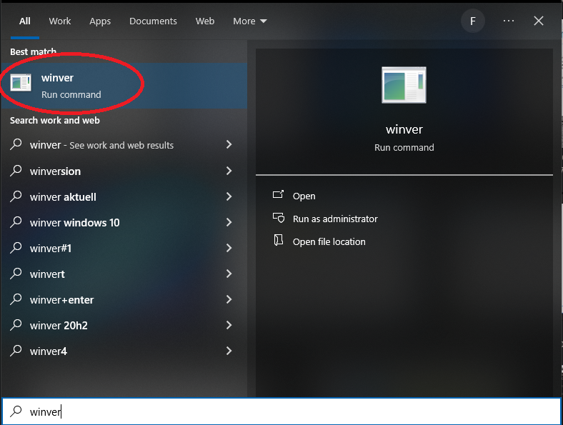
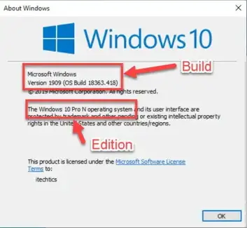

.. _GitHub: https://github.com/SchmollerLab/Cell_ACDC/issues

Import ``cv2`` failed: ``ImportError: DLL load failed``
=======================================================

If you see the following error::

    ImportError: DLL load failed: The specified module could not be found.

it is very likely that you are on a Windows 10/11 ``N`` or ``KN`` version. 

You can check if you have an ``N`` or ``KN`` version by typing ``winver`` in 
the Windows search bar and clicking on ``winver`` as in this screenshot:

    Runnning ``winver`` from Windows search bar

You will be able to see the Windows version in the window that opens:

    Windows version

If you see a ``N`` or ``KN`` in the Edition field then you need to **install the 
Media Feature Pack** which is required by ``opencv`` and it is not installed 
on ``N`` and ``KN`` versions of Windows. 

To install the Media Feature pack type ``optional feature`` in the Windows search 
bar and you should see something like "Add an optional feature". Click on that 
and then click on "Add a feature" on the top. Search for ``Media Feature Pack`` 
and install it.

After installation, re-start the computer and try Cell-ACDC again. 

If you don't manage to solve your issue, feel free to contact us by opening a 
new issue on our `GitHub`_ page or by sending me an email at :email:`padovaf@tcd.ie`. 

Until next time! 