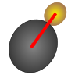

Cell-ACDC
=========
|

|BuildUbuntu| |BuildMacOS| |BuildWindows| |PythonVersion| |Licence| |PiPyVersion| |RepoSize|

.. |BuildUbuntu| image:: https://github.com/SchmollerLab/Cell_ACDC/actions/workflows/build-ubuntu.yml/badge.svg
   :target: https://github.com/SchmollerLab/Cell_ACDC/actions
.. |BuildMacOS| image:: https://github.com/SchmollerLab/Cell_ACDC/actions/workflows/build-macos.yml/badge.svg
   :target: https://github.com/SchmollerLab/Cell_ACDC/actions
.. |BuildWindows| image:: https://github.com/SchmollerLab/Cell_ACDC/actions/workflows/build-windows.yml/badge.svg
   :target: https://github.com/SchmollerLab/Cell_ACDC/actions
.. |PythonVersion| image:: https://img.shields.io/pypi/pyversions/cellacdc
   :target: https://www.python.org/downloads/
.. |Licence| image:: https://img.shields.io/badge/license-BSD%203--Clause-brightgreen
   :target: https://github.com/SchmollerLab/Cell_ACDC/blob/main/LICENSE
.. |PiPyVersion| image:: https://img.shields.io/pypi/v/cellacdc?color=red
   :target: https://pypi.org/project/cellacdc/
.. |RepoSize| image:: https://img.shields.io/github/repo-size/SchmollerLab/Cell_ACDC
   :target: https://github.com/SchmollerLab/Cell_ACDC

Welcome to Cell-ACDC's documentation!
-------------------------------------

.. note::

   The building of this documentation is under active development. Please, refer to our `User Manual <https://github.com/SchmollerLab/Cell_ACDC/blob/main/UserManual/Cell-ACDC_User_Manual.pdf>`_ in the meanwhile

Cell-ACDC is a GUI-based Python framework for **segmentation**, **tracking**, **cell cycle annotations** and **quantification** of microscopy data.

You can load and analyse **2D, 3D** (either single z-stacks or 2D images over time) and **4D** (3D z-stacks over time) images.

Additionally, you can load **as many additional fluorescent channels** as you wish. Cell-ACDC will then compute many **numerical features** for each segmented cell, such as mean, sum, max, quantiles etc.
It also performs **automatic background correction** and computes **protein amount**.

Other numerical features computed are **cell volume**, and morphological properties of the segmented object.

Resources
---------

* `User Manual`_ with **detailed instructions**
* `Publication`_ of Cell-ACDC publication
* `Forum`_ for discussions (feel free to **ask any question**)
* **Report issues, request a feature or ask questions** by opening a `new issue`_
* Twitter `thread`_

.. _User Manual: https://github.com/SchmollerLab/Cell_ACDC/blob/main/UserManual/Cell-ACDC_User_Manual.pdf
.. _Publication: https://bmcbiol.biomedcentral.com/articles/10.1186/s12915-022-01372-6
.. _Forum: https://github.com/SchmollerLab/Cell_ACDC/discussions
.. _new issue: https://github.com/SchmollerLab/Cell_ACDC/issues
.. _thread: https://twitter.com/frank_pado/status/1443957038841794561?s=20

Overview
--------

Let's face it, when dealing with segmentation of microscopy data we often do not have time to check that **everything is correct**, because it is a **tedious** and **very time consuming process**. Cell-ACDC comes to the rescue!
We combined the currently **best available neural network models** (such as `YeaZ <https://www.nature.com/articles/s41467-020-19557-4>`_,
`Cellpose <https://www.nature.com/articles/s41592-020-01018-x>`_, `StarDist <https://github.com/stardist/stardist>`_, and `YeastMate <https://github.com/hoerlteam/YeastMate>`_) and we complemented them with a **fast and intuitive GUI**.

We developed and implemented several smart functionalities such as **real-time continuous tracking**, **automatic propagation** of error correction, and several tools to facilitate manual correction, from simple yet useful **brush** and **eraser** to more complex flood fill (magic wand) and Random Walker segmentation routines.

.. toctree::
   :maxdepth: 1
   :hidden:

   installation
   getting-started
